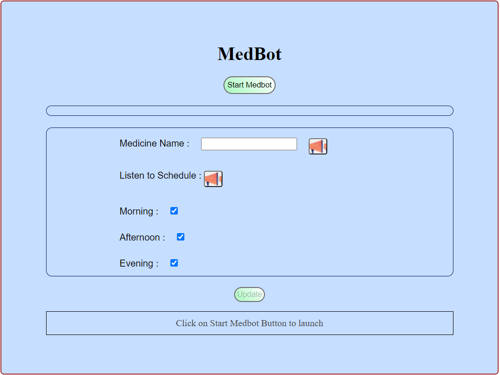
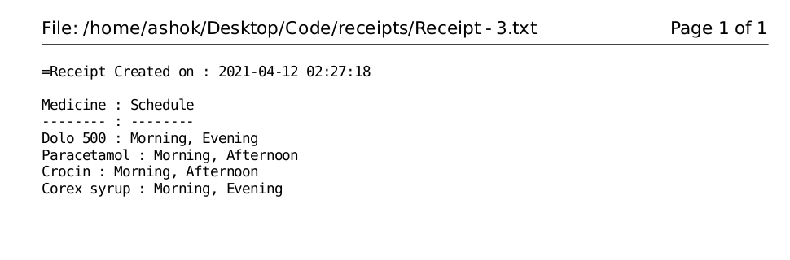

# MedBot

## Demo

- Command Line Interface

https://user-images.githubusercontent.com/64270972/124591980-93ae9280-de7a-11eb-969c-6c6846f70328.mp4

- Graphical User Interface

https://user-images.githubusercontent.com/64270972/124592043-a4f79f00-de7a-11eb-86a4-b4e1fc38baca.mp4

---

## Objective
Create a Tool for Voice Based Medicine Prescriptions in order to prevent spreading of any contagious diseases through hand-written prescriptions

---

## Implementation
Implemented Speech2Text and Text2Speech Functionality in 
three different forms : 
- Web Application
- Graphical User Interface (GUI)
- Command Line Interface (CLI)

Our main focus is to provide the same application experience for all users.

---

## Experimentation
- Create Automatic bots so that users need not to provide any commands to the application and provide a fast-learning experience
- Convert Synchronous Speak and Recognition API functionality to Asynchronous and then created a special wait function to make them Synchronous

---

## Snapshots

### Command Line Interface

### Graphical User Interface

### Web Application

## Sample Receipt

---

## Conclusion

We successfully implemented Speech2Text and 
Text2Speech Functionality in three different versions.

Our Project focuses on providing a better method to 
provide medical prescriptions allowing doctors to prevent 
any kind of physical contact with Infected and NonInfected People.

---

## References
- [SpeechSynthesisUtterance Docs](https://developer.mozilla.org/en-US/docs/Web/API/SpeechSynthesisUtterance)
- [Tkinter Docs](https://docs.python.org/3/library/tkinter.html)
- [SpeechRecognition Docs](https://pypi.org/project/SpeechRecognition/)
- [Pyttsx3 Docs](https://pypi.org/project/pyttsx3/)
- [Flask Docs](https://flask-doc.readthedocs.io/en/latest/)

---

## Developers
- [Akshay Jain](https://github.com/akshay-jain22)
- [Anand Kumar](https://github.com/anand-kumar007)
- [Ashok Kumar](https://github.com/ashok-2001)
  
